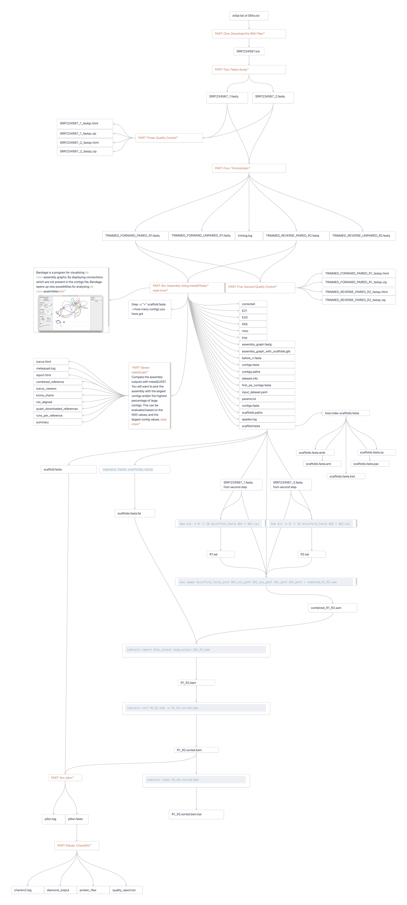

# SRAs
here is my personalized bioinformatic workflow starting from short reads from SRA database on CARC (HPC of USC)

# A Practical Guide to my Automated bioinformatic workflow in CARC


This repository provides a comprehensive guide and scripts to help myself to keep track of my bioinformatic workflow and organize my scripts.
in this guide, I'm going to explain my code line by line and try to maximize my clean coding skills.

---
Table of contents
=================

<!--ts-->
   * :hash: [Batch Job Script Header](#hash-batch-job-script-header)
   * 📥 [Inputs and Array Prerequisites](#inputs-and-array-prerequisites)
   * 🌐 [PART-One: Download the SRA Files](#part-one-download-the-sra-files)
   * 🔨 [PART-Two: Fastq-dump](#part-two-fastq-dump)
   * 🔍 [PART-Three: Quality Control](#part-three-quality-control)
   * :scissors: [PART-Four: Trimmomatic](#scissors-part-four-trimmomatic)
   * 🔍 [PART-Five: Second Quality Control](#part-five-second-quality-control)
   * 🧬 [PART-Six: Assembly Using metaSPAdes](#part-six-assembly-using-metaspades)
   * :mega: [PART-Seven: metaQuast](#mega-part-seven-metaquast)
   * :calling: [PART-Eight: bwa](#calling-part-eight-bwa)
   * :wrench: [PART-Nine: samtools](#wrench-part-nine-samtools)
   * :money_with_wings: [PART-Ten: pilon](#money_with_wings-part-ten-pilon)
   * :white_check_mark: [PART-Eleven: CheckM2](#white_check_mark-part-eleven-checkm2)
<!--te-->

Overview
====



:hash: [Batch Job Script Header](#batch-job-script-header)
====

```
#!/bin/bash
#SBATCH --account=asteen_1130
#SBATCH --partition=main
#SBATCH --cpus-per-task=8
#SBATCH --mem=64G
#SBATCH --nodes=2
#SBATCH --time=01:00:00
#SBATCH --array=1-2
```

📥[Inputs and Array Prerequisites](#inputs-and-array-prerequisites)
=====
### inputs
in this part you get two arguments, first is the input file(example provided in this repository [job_input_short.txt](job_input_short.txt)) and the output argument is the directory you chosed to save all results
```
# this is the file contains all the SRR names, srr names should be diveded by a newline(enter)
srr_input=$1

# this is the directory to save all the results
output_directory=$2
```

### organize job as array
```
# let's start separate inputs as array
echo "job started"
echo "this is job ${SLURM_ARRAY_TASK_ID}"

# now make a variable to feed as input to main script
line=$(sed -n -e "$SLURM_ARRAY_TASK_ID p" $srr_input)
```

🌐[PART-One: Download the SRA Files](#part-one-download-the-sra-files)
=====
in this step, we download the SRA files using the text file contains a list of SRR numbers.

> [!NOTE]  
> [What is SRA database?](https://en.wikipedia.org/wiki/Sequence_Read_Archive)
>
> [learn more on SRA search results](READMORE/SRA_database.md)


### load needed modules
```
module purge
module load gcc/8.3.0
module load sratoolkit/2.11.0

```

### make a directory for SRA raw file
```
mkdir -p $output_directory/00_raw_read_from_SRA
```

### download srr files
```
prefetch -p ${line} -O $output_directory/00_raw_read_from_SRA
```

🔨[PART-Two: Fastq-dump](#part-two-fastq-dump)
====
> [!TIP]
> The fastq-dump command is a utility from the SRA Toolkit (Sequence Read Archive Toolkit) used to convert SRA files (Sequence Read Archive format) into FASTQ format. The FASTQ format is commonly used for storing sequencing reads with quality scores and is compatible with most downstream bioinformatics tools, unlike the SRA format, which is more specialized.
### make a directory for fastq_dump
```
mkdir -p $output_directory/01_fastq_dump_result
```
### run fastq-dump
```
fastq-dump --split-3 -O $output_directory/01_fastq_dump_result/${line}/ $output_directory/00_raw_read_from_SRA/${line}/*.sra
```

🔍[PART-Three: Quality Control](#part-three-quality-control)
====
### load needed modules
```
module load gcc/11.3.0
module load fastqc/0.11.9
```

### make a directory to save Quality Control results
```
mkdir -p $output_directory/02_first_quality_control_results/${line}/
```

### execute quality control
```
fastqc -t $SLURM_CPUS_PER_TASK -o  $output_directory/02_first_quality_control_results/${line}/  $output_directory/01_fastq_dump_result/${line}/*.fastq
```

:scissors: [PART-Four: Trimmomatic](#scissors-part-four-trimmomatic)
====

**Trimmomatic** is a versatile tool used in bioinformatics for **trimming and quality filtering of sequencing reads**. we primarily apply it to **FASTQ files** obtained from last step to improve data quality before downstream analysis. The main tasks include removing low-quality bases, adapters, and unwanted sequences, and filtering out poor-quality reads.

## Key Functions of Trimmomatic
1. **Adapter Removal**: Removes adapters or other unwanted sequences introduced during the library preparation process.
2. **Quality Trimming**: Trims bases from the ends of reads that fall below a certain quality threshold, ensuring that only high-quality sequence data is retained.
3. **Length Filtering**: Discards reads that fall below a specified length after trimming to retain only informative reads.
4. **Sliding Window Trimming**: Trims reads based on a sliding window approach, where the average quality in a defined window must meet a threshold.

## Commonly Used Flags in Trimmomatic

Here's a summary of key flags you can use in Trimmomatic:

| Flag                    | Description |
|-------------------------|-------------|
| **PE** or **SE**        | Specifies whether the input is **paired-end** (PE) or **single-end** (SE) data. Use `PE` for paired-end reads with both forward and reverse files, and `SE` for single-end reads. |
| **ILLUMINACLIP**        | Removes adapter sequences. Takes four parameters: the path to the adapter file, the maximum mismatch count, the palindrome clip threshold, and the simple clip threshold. <br>Example: `ILLUMINACLIP:adapters.fa:2:30:10` |
| **LEADING**             | Trims bases from the start (5' end) of a read if they are below a specified quality threshold. <br>Example: `LEADING:20` |
| **TRAILING**            | Trims bases from the end (3' end) of a read if they are below a specified quality threshold. <br>Example: `TRAILING:20` |
| **SLIDINGWINDOW**       | Performs a sliding window trimming, where a window of a specified size is applied to the read, and if the average quality in that window falls below the set threshold, the read is trimmed at that point. <br>Example: `SLIDINGWINDOW:4:20` (uses a 4-base window with a quality threshold of 20) |
| **MINLEN**              | Discards reads that fall below a specified minimum length after trimming. <br>Example: `MINLEN:36` |
| **CROP**                | Trims reads to a specified length from the start (5' end), useful when you want to retain only the first part of a read. <br>Example: `CROP:100` (keeps only the first 100 bases of each read) |
| **HEADCROP**            | Trims a specified number of bases from the start (5' end) of each read. <br>Example: `HEADCROP:15` (removes the first 15 bases of each read) |
| **AVGQUAL**             | Discards reads with an average quality below a specified threshold, ensuring overall read quality. <br>Example: `AVGQUAL:30` |


### first load the required modules
```
module load gcc/11.3.0
module load trimmomatic/0.39
```

### to see trimmomatic help use
```
trimmomatic -h
```

### make a directory for trim results
```
mkdir -p $output_directory/03_trimmomatic_results/${line}/
```

### run trimmomatic
```
trimmomatic PE -threads $SLURM_CPUS_PER_TASK -phred33 -trimlog $output_directory/03_trimmomatic_results/${line}/trimlog.log $output_directory/01_fastq_dump_result/${line}/*.fastq $output_directory/03_trimmomatic_results/${line}/TRIMMED_FORWARD_PAIRED_R1.fastq $output_directory/03_trimmomatic_results/${line}/TRIMMED_FORWARD_UNPAIRED_R1.fastq $output_directory/03_trimmomatic_results/${line}/TRIMMED_REVERSE_PAIRED_R2.fastq $output_directory/03_trimmomatic_results/${line}/TRIMMED_REVERSE_UNPAIRED_R2.fastq LEADING:20 TRAILING:20 SLIDINGWINDOW:13:20 MINLEN:40
```

🔍[PART-Five: Second Quality Control](#part-five-second-quality-control)
====
### load needed modules
```
module load gcc/11.3.0
module load fastqc/0.11.9
```

### make a directory to save Quality Control results
```
mkdir -p $output_directory/04_second_quality_control_results/${line}/
```
### execute quality control
```
fastqc -t $SLURM_CPUS_PER_TASK -o  $output_directory/04_second_quality_control_results/${line}/  $output_directory/03_trimmomatic_results/${line}/TRIMMED_FORWARD_PAIRED_R1.fastq $output_directory/03_trimmomatic_results/${line}/TRIMMED_REVERSE_PAIRED_R2.fastq
```

🧬[PART-Six: Assembly Using metaSPAdes](#part-six-assembly-using-metaspades)
====
**MetaSPAdes** is an assembly tool designed for metagenomic data, focusing on constructing genomes from mixed community DNA sequencing data.
After running MetaSPAdes, you get several output files that represent different aspects of the assembly. Here’s an overview of the primary output files and their purposes:

| Output File/Folder                | Description |
|-----------------------------------|-------------|
| **contigs.fasta**                 | Contains assembled contigs (continuous sequences) derived from overlapping reads. This file represents the main output and contains sequences that can be analyzed further to identify potential organisms and gene content. |
| **scaffolds.fasta**               | Similar to `contigs.fasta`, but with additional connections between contigs based on paired-end information. Scaffolds are longer sequences that can include gaps where MetaSPAdes inferred connections between contigs. |
| **before_rr.fasta**               | The contigs generated before repeat resolution. Repeat resolution is a step that helps in handling regions with repetitive sequences to improve contig uniqueness and accuracy. |
| **assembly_graph.fastg**          | A graph-based representation of the assembly. Each node represents a sequence (often a contig or part of a contig), and each edge represents connections between sequences based on overlap. This file is useful for visualizing complex assembly paths, especially for highly diverse metagenomic samples. |
| **assembly_graph_with_scaffolds.gfa** | A graph representation in **GFA** format that includes scaffolds. It provides a more comprehensive view of the assembly, with nodes and edges representing sequences and their connections, allowing for complex genome visualization and analysis. |
| **KmerCount.log**                 | Logs the k-mer (subsequence) counts used in the assembly. This file provides details on the different k-mer sizes used and the frequency of each k-mer, helping in quality control analysis by showing how well-covered certain regions are. |
| **params.txt**                    | Contains the parameters used in the MetaSPAdes run, providing documentation of the input settings, which is useful for reproducibility and tracking specific configuration details in the assembly. |
| **spades.log**                    | The primary log file for the MetaSPAdes process. It records the steps and any issues encountered during assembly, which is useful for troubleshooting and tracking the assembly process. |
| **warnings.log**                  | Lists any warnings encountered during the assembly, such as low-coverage areas or potential contaminants. This helps identify potential problems with the assembly quality. |

- **Primary Output**: The `contigs.fasta` file is the main outcome, containing assembled sequences.
- **Supporting Outputs**: Files like `assembly_graph.fastg` and `scaffolds.fasta` provide additional structural and linkage information.
- **Log Files**: Files like `spades.log`, `warnings.log`, and `KmerCount.log` are critical for assessing the quality of the assembly and troubleshooting issues.
- **other outputs**: `contigs.paths`, `scaffold.paths`, `dataset.info`, `first_pe_contigs.fasta`, `input_dataset.yaml`
- These outputs provide a comprehensive set of data to help analyze, evaluate, and understand the structure and quality of the assembled metagenomic sequences.
- In Cameron's class we used scaffold.fasta as main output to do the downstream analysis.


### module load
```
module load gcc/8.3.0
module load spades/3.13.0
```

### make a directory to save the assemply results
```
mkdir -p $output_directory/05_Spades_results/${line}
```

### run metaSPAdes
here in this code the most srtdarsdrs
you should spend sometime to adjust variables above depending on input
```
spades.py --meta --threads $SLURM_CPUS_PER_TASK --memory $SLURM_MEM_PER_NODE --pe1-1 $output_directory/03_trimmomatic_results/${line}/TRIMMED_FORWARD_PAIRED_R1.fastq --pe1-2 $output_directory/03_trimmomatic_results/${line}/TRIMMED_REVERSE_PAIRED_R2.fastq -o $output_directory/05_Spades_results/${line}/
```

:mega: [PART-Seven: metaQuast](#part-seven-metaQuast)
====

**MetaQuast** is a tool designed to assess the quality of metagenomic assemblies. It provides metrics that help evaluate the accuracy, completeness, and contiguity of assembled contigs from metagenomic data. MetaQuast is an extension of **Quast** (Quality Assessment Tool for Genome Assemblies), tailored specifically for metagenomics.
## Key Functions of MetaQuast
- **Quality Assessment**: MetaQuast evaluates assembly quality by comparing contigs to reference genomes when available, providing metrics such as N50, misassemblies, and gene completeness.
- **Contig Mapping and Taxonomic Classification**: It maps contigs to reference genomes or taxonomic databases, allowing you to assess how well the assembly represents each species or taxonomic group.
- **Visualization**: Generates reports and visualizations of the assembly metrics, allowing for an easier assessment of assembly performance and quality.

## Outputs of MetaQuast

MetaQuast generates a comprehensive set of outputs that provide both summary statistics and detailed metrics for each assembly. Here’s an overview of the primary outputs:

| Output File/Folder           | Description |
|-------------------------------|-------------|
| **report.txt**                | A summary report containing core assembly statistics such as N50, total length, number of contigs, GC content, and misassemblies. This file provides a quick overview of the quality metrics. |
| **report.html**               | An HTML version of the report with additional visualization and interactivity. This file is helpful for easy viewing and sharing of results. |
| **contigs_reports/ folder**   | Contains detailed information for each contig, including alignment information, coverage, and GC content. This is useful for examining individual contigs and their quality. |
| **misassemblies_report.txt**  | Lists all detected misassemblies with information on where they occur in the contigs. Misassemblies indicate regions where the contig structure may be incorrect, often due to chimeric or low-quality regions. |
| **unaligned_contigs.fasta**   | Contains contigs that could not be aligned to any reference genome or database, potentially indicating novel or poorly represented sequences. |
| **aligned_stats.tsv**         | A table with alignment statistics for each contig, showing how well contigs align to the reference genomes or taxonomic groups. |
| **taxonomic_profile.txt**     | Contains a summary of the taxonomic composition of the contigs based on alignment. This is useful for understanding which organisms are present in the sample and how well they are represented in the assembly. |
| **plots/ folder**             | Contains visualizations such as length and GC content distributions, N50 graphs, and misassembly locations. These plots help visualize the quality of the assembly in a more intuitive way. |
| **reference genome folders**  | If reference genomes are used, MetaQuast generates folders with information on how the assembled contigs compare to each reference, detailing alignment metrics and completeness. |

### first you need to download metaquast from the following website [HERE](https://quast.sourceforge.net/metaquast.html)
### you need to unzip it using 
```
tar -zxvf filename.tar.gz
```

### make a directory for results
```
mkdir -p $output_directory/06_metaQuast_results/${line}
```
### run metaQuast
```
metaQuast/quast-5.2.0/metaquast.py $output_directory/05_Spades_results/${line}/scaffolds.fasta -o $output_directory/06_metaQuast_results/${line}/
```


:calling: [PART-Eight: bwa](#part-eight-bwa)
====
# BWA (Burrows-Wheeler Aligner)

**BWA (Burrows-Wheeler Aligner)** is a popular bioinformatics tool used for mapping DNA sequences against a large reference genome, such as the human genome. It aligns **short reads** (e.g., from Illumina sequencing) or **longer sequences** (e.g., from PacBio or Oxford Nanopore) to a reference genome with high efficiency and accuracy. BWA is essential in various genomic analyses, including variant calling, transcriptomics, and metagenomics.

## Key Functions of BWA
1. **Mapping of Sequencing Reads**: BWA aligns sequencing reads (in FASTQ format) to a reference genome (in FASTA format), generating alignment files in **SAM/BAM format** that can be used for downstream analyses.
2. **Handling Short and Long Reads**: BWA has different algorithms optimized for short reads (up to ~100bp) and longer reads (up to 1 million bp), making it versatile for various sequencing platforms.
3. **Indexing of Reference Genome**: BWA first constructs an index of the reference genome to allow for efficient alignment. This index, created with the Burrows-Wheeler Transform (BWT), reduces memory and computational requirements during alignment.
4. **Paired-End and Single-End Alignment**: BWA supports both single-end (one direction) and paired-end (both directions) sequencing data, which is common in modern sequencing technologies.
5. **Gapped and Ungapped Alignments**: It can handle both types, allowing for insertion-deletion (indel) detection, which is essential in analyzing regions with small structural variations.

## Main Algorithms in BWA

BWA consists of three primary algorithms, each suited for different types of reads:
1. **BWA-backtrack**: Optimized for short reads up to 100bp, ideal for older Illumina data.
2. **BWA-MEM**: The most widely used algorithm, optimized for reads of 70bp or longer, including Illumina, PacBio, and Nanopore reads. BWA-MEM is robust, accurate, and the preferred choice for most applications.
3. **BWA-SW**: Suitable for longer reads with more complex alignment patterns, like those from Sanger sequencing or some RNA-seq data.

### load modules
```
module purge
module load gcc/11.3.0
module load bwa/0.7.17
```
### make a directory for results and copy the scaffolds.fasta as input to that directory
```
mkdir -p $output_directory/07_bwa/${line}
cp $output_directory/05_Spades_results/${line}/scaffolds.fasta $output_directory/07_bwa/${line}/scaffolds.fasta
```

### paths to scaffold and R1 and R2
```
scaffold_fasta_path=$output_directory/07_bwa/${line}/scaffolds.fasta
R1_path=$output_directory/01_fastq_dump_result/${line}/*_1.fastq
R2_path=$output_directory/01_fastq_dump_result/${line}/*_2.fastq
```

### run index (make the genome accessible for alignment)
```
bwa index $scaffold_fasta_path
```
The command bwa index file.fasta is used to prepare a reference genome for alignment by creating an index of the provided FASTA file (file.fasta) using the BWA (Burrows-Wheeler Aligner) tool.

Indexing: This command builds an index of the reference genome, which allows BWA to quickly align sequencing reads to this reference. Indexing reduces the computational time and memory requirements when aligning reads, as it allows BWA to search the reference genome more efficiently.
## Output
- **Index Files**: BWA generates multiple index files based on the input reference genome. These files have specific extensions and are saved in the same directory as `file.fasta`. They include:
  - `.amb`: Contains information about ambiguous base pairs in the reference.
  - `.ann`: Contains information about annotations (like chromosome names and lengths).
  - `.bwt`: The Burrows-Wheeler Transform (BWT) of the reference, enabling efficient alignment.
  - `.pac`: Contains packed sequences of the reference, storing the genome efficiently in binary format.
  - `.sa`: The suffix array, which speeds up searching in the BWT.


### alignment steps (run this one on original fastq files before trimming-> 01_fastq_dump_result)
```
bwa aln -n 0 -t 16 $scaffold_fasta_path $R1_path > $output_directory/07_bwa/${line}/R1.sai
bwa aln -n 0 -t 16 $scaffold_fasta_path $R2_path > $output_directory/07_bwa/${line}/R2.sai
```
The purpose of this command is to **align reads from a sequencing file** (`$R1_path`) to a **reference genome or scaffold** (`$scaffold_fasta_path`) and save the output in an alignment file (`$output`). It uses the following specific options:

- **`-n 0`**: Sets the maximum number of mismatches allowed in the alignment to zero. This means the tool will only output perfect matches between the read and reference. Using `-n 0` is stringent and is typically used for high-confidence alignments or in cases where exact matching is critical.
  
- **`-t 16`**: Specifies the number of **threads** to use, set to 16 in this case. This allows BWA to use parallel processing, making alignment faster by utilizing multiple CPU cores.

## Output
- **Output File (`R1.sai or R2.sai`)**: This command creates a **SAI (Suffix Array Index) file**. The SAI file is an intermediate file format that contains information about the alignment of each read to the reference. It does not directly contain the final alignment in SAM or BAM format. Instead, it needs to be converted to SAM format using `bwa samse` (for single-end data) or `bwa sampe` (for paired-end data).


### make path for new outputs
```
R1_sai_path=$output_directory/07_bwa/${line}/R1.sai
R2_sai_path=$output_directory/07_bwa/${line}/R2.sai
# i should read about this outputs, it uses R1 and database to align them
```
### combine them
```
bwa sampe $scaffold_fasta_path $R1_sai_path $R2_sai_path $R1_path $R2_path > $output_directory/07_bwa/${line}/combined_R1_R2.sam
```
This command merges alignment information from two sequencing files (one for each read direction) into a single SAM file. The SAM file includes information about how each read aligns to the reference genome, taking into account the pairing information, which is important for accurate alignment of paired-end reads.

## Output

- **SAM File (`combined_R1_R2.sam`)**: The output of this command is a **SAM (Sequence Alignment/Map) file**, which contains the final paired-end alignments. The SAM file provides detailed information for each read pair, including:
  - The reference sequence name and position to which each read aligns.
  - Mapping quality scores.
  - Flags indicating pairing information, such as whether the read is the first or second in the pair, if it’s aligned to the forward or reverse strand, and other pairing details.
  - Additional alignment attributes such as CIGAR strings (describing matches, insertions, deletions), edit distances, and alignment confidence.


:wrench: [PART-Nine: samtools](#part-nine-samtools)
====

### load modules
```
module purge
module load gcc/9.2.0
module load samtools/18.0.4
```

### run sotneareiodhn -> this command will produce a .fai file
```
samtools faidx $scaffold_fasta_path
```
### path to output of the last command
```
fai_output=$output_directory/07_bwa/${line}/*.fai
sam_output=$output_directory/07_bwa/${line}/combined_R1_R2.sam

samtools import $fai_output $sam_output $output_directory/07_bwa/${line}/R1_R2.bam
samtools sort $output_directory/07_bwa/${line}/R1_R2.bam -o $output_directory/07_bwa/${line}/R1_R2.sorted.bam
samtools index $output_directory/07_bwa/${line}/R1_R2.sorted.bam
```

:money_with_wings: [PART-Ten: pilon](#part-ten-pilon)
====

### load modules
```
module purge
module load gcc/8.3.0
module load pilon/1.22
```
### make directory for pilon results
```
mkdir -p $output_directory/08_pilon_results/${line}
```
### make a path for the input
```
sorted_sam_output=$output_directory/07_bwa/${line}/R1_R2.sorted.bam
```
# warning -> bam or sam in command above?
### run pilon
```
pilon --genome $scaffold_fasta_path --frags $sorted_sam_output --fix all,local,breaks --changes --outdir $output_directory/08_pilon_results/${line}  > $output_directory/08_pilon_results/${line}/pilon.log
```


:white_check_mark: [PART-Eleven: CheckM2](#white_check_mark-part-eleven-checkm2)
====

### first you need to install it, the best way to do it on CARC is the following conda environment
```
# make conda environment
conda create -n checkm2 -c conda-forge -c bioconda python=3.8 checkm2

# activate conda environment you just made
conda activate checkm2

# to make sure it is installed
checkm2 -h
```
please do the following steps once and don't use the discovery login node, reminder that you can use the command below to ask for a compute node
```
salloc --ntasks=1 --cpus-per-task=16 --time=01:00:00 --mem=128GB -p main
```
### also if you want to run CheckM2 as bash script, you should activate conda using the following commands
```
module purge
eval "$(conda shell.bash hook)"
conda activate checkm2
```

### you also need to download a database which CheckM2 uses
```
checkm2 database --download --path /path/to/save/database
```


### run CheckM2
```
checkm2 predict -t $SLURM_CPUS_PER_TASK -x input_file_type -i path/to/input.fasta -o path/to/output
# example
checkm2 predict -t 16 -x .fasta -i pilon.fasta -o checkm2_out
```

:money_with_wings: [PART-Twelve: DRAM](#pstrstarst)
====

DRAM (Distilled and Refined Annotation of Metabolism) is a tool for annotating metagenomic assembled genomes and VirSorter identified viral contigs. DRAM annotates MAGs and viral contigs using KEGG (if provided by the user), UniRef90, PFAM, dbCAN, RefSeq viral, VOGDB and the MEROPS peptidase database as well as custom user databases. DRAM is run in two stages. First an annotation step to assign database identifiers to gene, and then a distill step to curate these annotations into useful functional categories. Additionally, viral contigs are further analyzed during to identify potential AMGs. This is done via assigning an auxiliary score and flags representing the confidence that a gene is both metabolic and viral.

For more detail on DRAM and how DRAM works please see our [paper](https://academic.oup.com/nar/article/48/16/8883/5884738) as well as the [wiki](https://github.com/WrightonLabCSU/DRAM/wiki).

### Installation on CARC
While there are several installation methods available, this is the one that worked best for me.
#### Release Candidate Installation
The latest version of DRAM is often a release candidate, and these are not pushed to pypi, or Bioconda and so can't be installed with the methods above. You can tell if there is currently a release candidate by reading the release notes.

To install a potentially unstable release candidate, follow the instructions below. Note the comments within the code sections as there is a context in which commands must be used.
```
# Clone the git repository and move into it
git clone https://github.com/WrightonLabCSU/DRAM.git
cd DRAM
# Install dependencies, this will also install a stable version of DRAM that will then be replaced.
conda env create --name my_dram_env -f environment.yaml
conda activate my_dram_env
# Install pip
conda install pip3
pip3 install ./
```
don't forget that if you want to do the steps above, you need to have a interactive mode.
You have now installed DRAM, and are ready to set up the databases.

### Downloading the DataBase
use the script below to download database
```
#!/bin/bash
#SBATCH --account=asteen_1130
#SBATCH --partition=main
#SBATCH --cpus-per-task=16
#SBATCH --mem=128G
#SBATCH --nodes=2
#SBATCH --time=20:00:00


module purge
eval "$(conda shell.bash hook)"
conda activate my_dram_env


cd path/to/save/DRAM_data
DRAM-setup.py prepare_databases --output_dir path/to/save/DRAM_data
```


